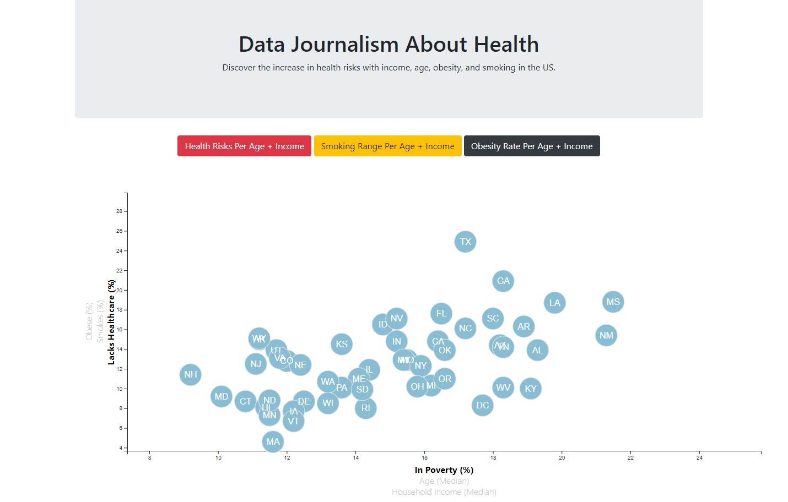
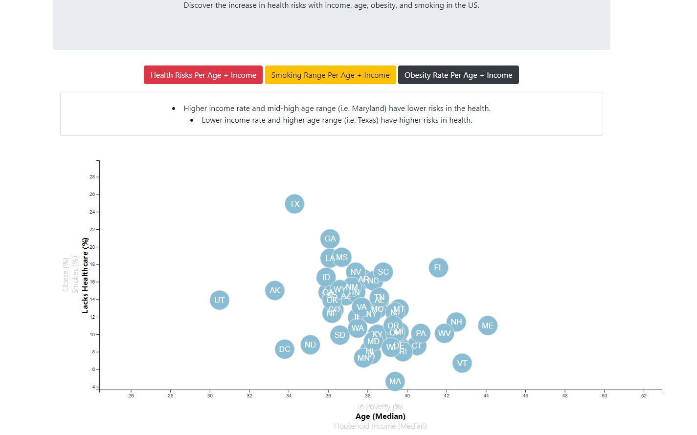
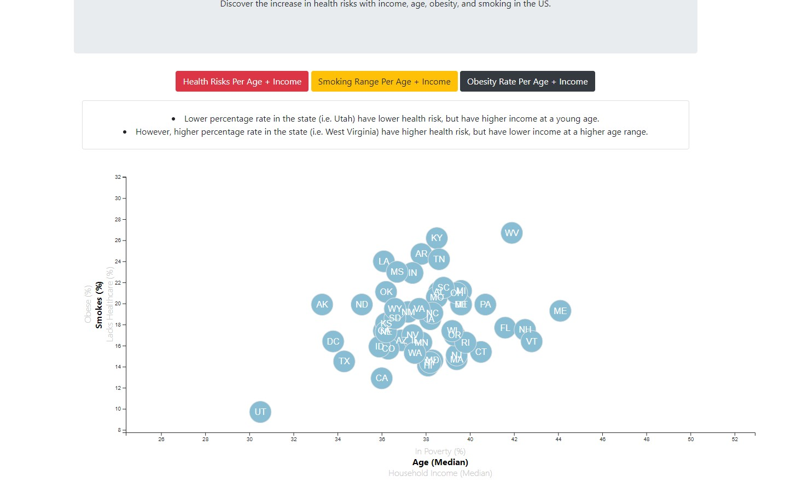
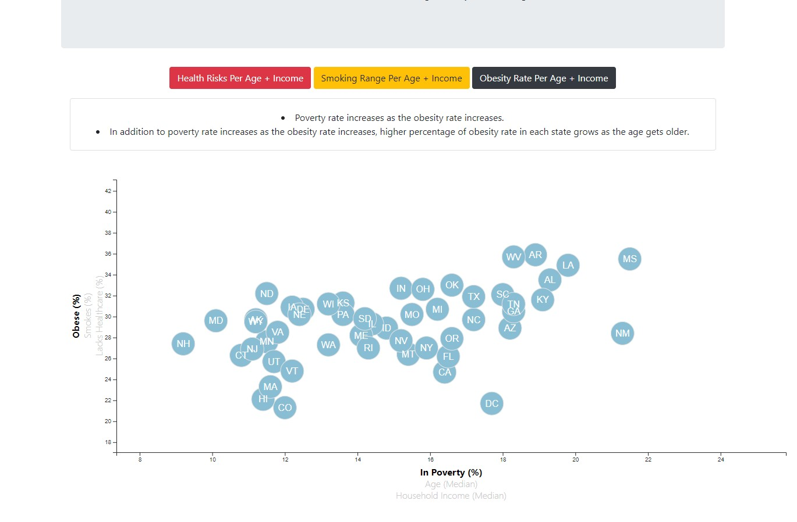

# D3 Challenge Project: Data Journalism and D3.js
### Increase in health risks changes with income, age, obesity, and smoking.
Using D3 technique we learned in class, we create a scatter plot that shows 
each state with circle elements that tell about relationships between health 
risks and income rate, and so on. 

* Include state abbreviations in the circles.

* Brief summaries below the chart for comparing each x and y axis elements.

* Deployment to Github Page: https://erikayi.github.io/D3-challenge/

### Screenshots:

### Updated:

### Original:

